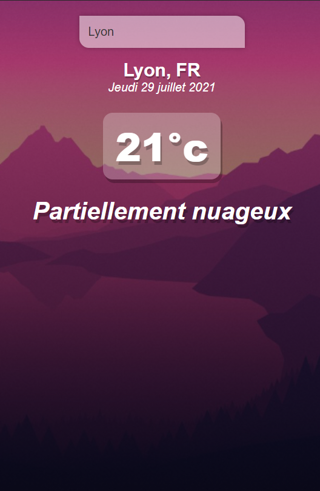
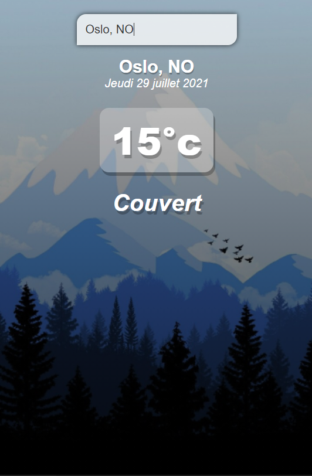

# My weather App project :

Hello !

Here is my first Vue.js project, a small weather app using openweathermap API to know what's the weather like on the other of the planet.
Soory the app is in french :-)

## Project setup

```
npm install
```

### Compiles and hot-reloads for development

```
npm run serve
```

### Some screenshots of the app :

###### When it's to go hiking in the moutains :



###### When it's to go skiing :


